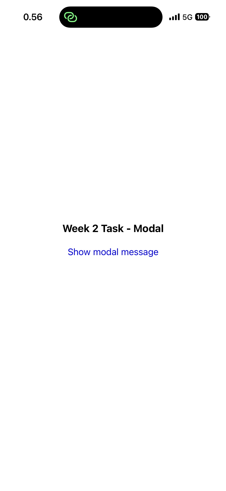
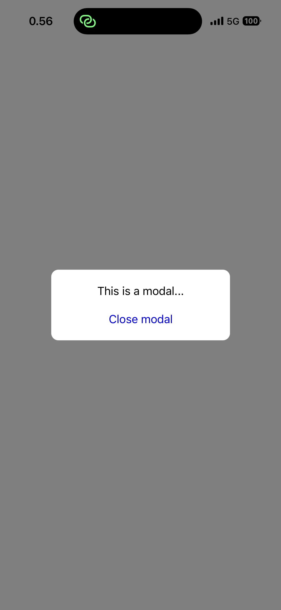

# Modal - Week 2 Task
This is a simple Expo project for the course *Web- ja hybriditeknologiat mobiiliohjelmoinnissa*.
The application demonstrates the use of **Pressable** and **Modal** components.

---

## Screenshots

### Home screen

### Modal open

---

## Features

- Press the **"Show modal message"** text to open a modal
- Modal displays a message and a **Close** button
- Press **Close** to hide the modal
- On Android, you can also close the modal by using the hardware back button
- Modal content is centered and overlay darkens background

---

## Technologies Used

- React Native
- Expo
- TypeScript

---

## License

This project is created for educational purposes. 
